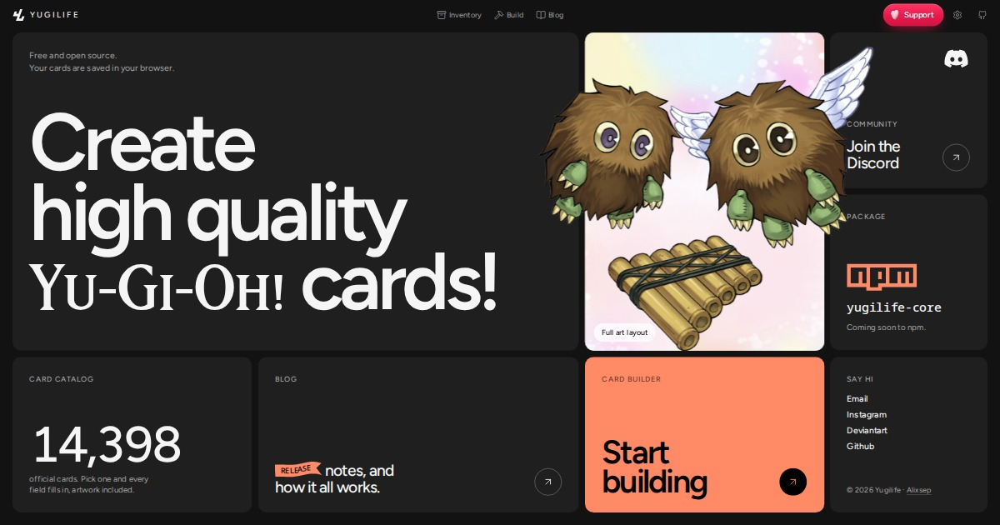

# Yugilife

**A free, open-source Yu-Gi-Oh! card maker that runs in your browser.**

[Open Yugilife](https://alixsep.github.io/yugilife/) · [Blog](https://alixsep.github.io/yugilife/blog/) · [Discord](https://discord.gg/cC4snQrtyM)



Yugilife lets you design custom Yu-Gi-Oh! cards with an accurate Series 10 template, start from any
of 14,000+ official cards, and export print-quality images. There is no account and no server: your
cards are saved in your browser.

> Under development again after six years. I want to thank everyone who kept emailing me and
> encouraging me to continue this project.

## Why Yugilife

Yugilife is built to be the most complete Yu-Gi-Oh! card maker there is, and it is deliberately
overkill:

- **Real rich text, not a text box.** Italics, bold, colors, superscript and subscript, ruby
  (furigana), explicit alignment, local scaling, custom spacing, and controlled line breaks, written
  as a small markup that is kept exactly as typed and rendered identically in the preview, SVG, and
  every export.
- **Text that fits like the real cards.** Effect and Pendulum text pick the largest size that fits,
  compress a slightly long line within a set limit instead of shrinking the whole box, and keep a
  Fusion, Synchro, Xyz, or Link material line on its own.
- **14,000+ official cards built in.** Search a name, pick a card, and every field fills in: name,
  type line, effect, ATK/DEF or Link rating and arrows, attribute, level, rank or scales, set code,
  passcode, and the official artwork with its foreground mask.
- **Full art (Overframe / extended art).** The artwork covers the whole card and its subject steps out
  over the frame, with a masking workspace to cut your own art: upload an alpha mask or place points,
  with anti-aliasing and glow. It runs locally in WebAssembly, with no external API.
- **Every card type and detail.** Normal, Effect, Ritual, Fusion, Synchro, Xyz, Pendulum, Link, Token,
  Spell, and Trap on an accurate Series 10 template, plus per-field text color and outline and 13
  Eye of Anubis security foil stickers.
- **Print-quality export.** PNG, JPEG, and WebP from half size to 8x or any custom width, and SVG that
  stays sharp at any size, with outlined text so it looks the same on every computer.
- **Yours, and open.** No account and no server: cards live in your browser's Inventory and export to
  an editable JSON project. Templates are open data, and
  [`yugilife-cli`](packages/yugilife-cli) renders cards from the command line with the same
  renderer as the website.

## Repository

```
apps/yugilife             the website
packages/yugilife-core    the renderer: templates in, SVG, PNG, JPEG, or WebP out
packages/yugilife-templates  card templates, textures, fonts, and layouts as data
packages/yugilife-cli     yugilife-core on the command line
```

The renderer knows nothing about Yu-Gi-Oh!. Everything a card looks like is declared by its
template, so a template fix never needs a code change. How it was built is written up on the
[blog](https://alixsep.github.io/yugilife/blog/).

## Run it locally

Requires Node.js 24 and pnpm 11.

```bash
pnpm install
pnpm dev
```

`pnpm check` runs the full verification (lint, types, unit, and browser tests); it needs the test
browsers from `pnpm setup:browsers` first.

## License

[AGPL-3.0](apps/yugilife/LICENSE). Yu-Gi-Oh! is a trademark of Konami. Yugilife is a fan project and is
not affiliated with or endorsed by Konami.
